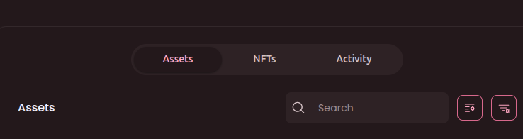

## How to Add a Symbiosky Testnet Token (Asset) in **Brave Wallet** 🦁


### ✅ Step-by-Step Tutorial

### **1. Open Brave Wallet**

* Click the **wallet icon** in the Brave browser toolbar
  OR
* Go to: `brave://wallet`

---

### **2. Go to the Assets Tab**

* Inside the wallet, open the **“Assets”** section.

---

### **3. Click “Add Asset”**

* Look for the **➕ Add Asset** button.
* Click it.





---

### **4. Select “Add Custom Asset”**

* Choose **“Add Custom Asset”** (not from the default token list).


---

### **5. Enter Token Details**

You will need to fill in:

* **Network** → Select correct network -> Arbitrum Sepolia
* **Contract Address** → Paste the token contract address 

```
0x072A24E0C25a5D8c7F3f62146eF1900b5033e42d
```

* **Token Name** → *SYSKY Token*
* **Token Symbol** →  *SYSKY*
* **Decimals** →  **18** 

👉 Tip: Once you paste the contract address, Brave often auto-fills the rest.

---

### **6. Click “Add”**

* Confirm by clicking **Add Asset**.
* Your token will now appear in your wallet.

---

## ⚠️ Important Tips

* Always copy the contract address from trusted sources:

  * Official project website
  * Verified block explorers (arbiscan, Etherscan)
* Wrong contract = fake token display.
